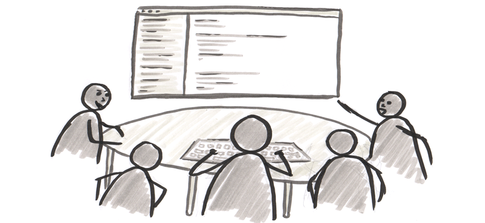

# Kata Gilded Rose - mob programming
---

### Definitie

>**Mob programming** is a software development approach where the whole team works on the same thing, at the same time, in the same space, and at the same computer.
...
>In addition to software coding, a mob programming team can work together to do almost all the work a typical software development team tackles, such as defining user stories or requirements, designing, testing, deploying software, and working with the customer and business experts. Almost all work is handled in working meetings or workshops, and all the people involved in creating the software are considered to be team members, including the customer and business experts.

Bron: [Wikipedia](https://en.wikipedia.org/wiki/Mob_programming)

###Enkele punten
####Driver/Navigators pattern

>In this “Driver/Navigator” pattern, the Navigator is doing the thinking about the direction the team wants to go, and then verbally describes and discusses the next steps of what the code must do. The Driver is translating the spoken English into code. In other words, all code written goes from the brain and mouth of the Navigator through the ears and hands of the Driver into the computer.
>
>Usually there is one Driver, and the rest of the team joins in as Navigators. One important benefit is that everybody is communicating and discussing the design to everyone on the team. Everyone stays involved and informed.
>
>The main work is Navigators “thinking , describing, discussing, and steering” what the team designing/developing. The coding done by the Driver is simply the mechanics of getting actual code into the computer. The Driver is also often involved in the discussions, but her main job is to translate the ideas into code. 
>
>If the Driver is not highly skilled, the rest of the team will help by guiding the Driver in how to create the code.
>
Bron (met hier en daar wat aanpassingen): [https://mobprogramming.org/mob-programming-basics/](https://mobprogramming.org/mob-programming-basics/)

####Rotation

>Rotate the Driver every 15 minutes - the current Driver moves away from the keyboard and joins the Navigators, and the next person moves to the keyboard to start typing.

Bron (met hier en daar wat aanpassingen): [https://mobprogramming.org/mob-programming-basics/](https://mobprogramming.org/mob-programming-basics/)

### Andere/diverse bronnen
- [https://twitter.com/woodyzuill](https://twitter.com/woodyzuill)
- [https://leanpub.com/mobprogramming](https://leanpub.com/mobprogramming)
***
[Terug](../README.md)
